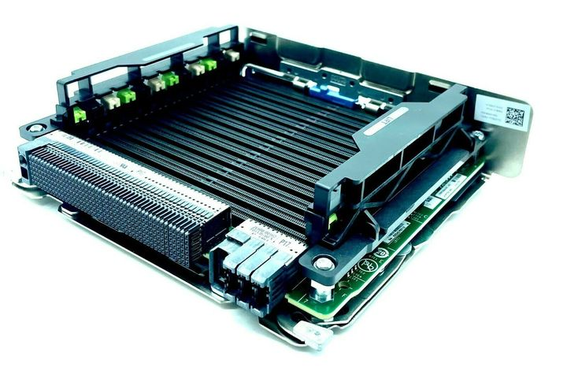

#! https://zhuanlan.zhihu.com/p/680368784

# 垃圾佬的服务器研究记录（缓慢更新）

## 前言

**我不是专业垃圾佬，有错误欢迎指正**

众所周知，垃圾佬的服务器百花齐放，最丐的有几十元矿板、路由器、工控机等，最高的有刀箱插满等

捡垃圾都是大伙的爱好，真实情况可能大伙个顶个的有钱（虽然至少我不是）

对于垃圾佬而言，所谓服务器其实不是某种特定机型，比如机架、刀片这种，而是任何能够执行所需服务的机器，也因此诞生出很多奇葩的垃圾佬特有的“服务器”

于是我萌生了一个想法就是把这些花哨方案做个大合集，这样就能给想折腾的垃圾佬们扩展一下可选方案

由于财力不足，很多东西我自己没玩过，大多都是参考别人的视频或者官方介绍，而且价位时常变动，因此并不一定适合作为特定预算参考方案，只能开阔下眼界啥的

## 介绍

在详细介绍型号前需要介绍一些基本的硬件知识

### 芯片组

现在比较流行的是x99主板，但是x99主板不一定是真的x99芯片组，所谓寨板就是不一定采用原生x99芯片组的主板，都是山寨厂商自己折腾的，有的可能上到C612芯片组，有的可能是B85、[H81](http://www.huananzhi.com/more.php?lm=10&id=784)、[H55、P55](http://www.huananzhi.com/more.php?lm=10&id=870)、[Q87](http://www.huananzhi.com/more.php?lm=10&id=318)

为何能够通用呢？首先看插槽（这里指改完后呈现的插槽），都是FCLGA2011又或者说2011-3（最近看见个视频，甚至2011也即X79的放上去都能点亮，不知道是不是特例[2024科技奇迹！抽象！太抽象了！](https://www.bilibili.com/video/BV1de411a72A/?t=217)）


当然，插槽一样也只能说你能插上去，具体能不能点亮还要看芯片组，在X99及之前时代的芯片组没有阉割对服务器U的支持，所以就能出现华南这种用别的芯片组配合对应插槽使用的情况

然而现在的消费级芯片组普遍是不支持服务器或者工作站的CPU的，比如10代的工作站主板w480能用w-1200系但是z490不能用

而这种以次充好的操作自然会缺少一些功能，比如C612芯片组能够支持单条64GB内存，C602芯片组也能，但是其它的基本都不支持

以及除了服务器芯片组能支持双路及以上外其余芯片组都不能支持


越往后企业级与消费级芯片组的功能差异就越大，但一般用户也基本碰不到那么多高级功能就是了

### 扩展性

很多人买服务器或工作站基本都是为了扩展性，比如40多条PCIE通道，12代也才20，10代也才12

关于通道我推荐个视频[【11006】CPU的PCIe通道在主板上是如何分配的？PCIe设备与固态硬盘到底应该安装在哪个插槽上？](https://www.bilibili.com/video/BV1cC4y1C7kP)

经常听到X16、X8等说法，并不一定是真实占用通道数，一些主板会自动拆分，有的阴间些的当你插多一张网卡，两个X16都变成X8会搞得显卡跑不满带宽，高端的主板基本都有更好的拆分功能，低端的有的只能自动拆分，占满了就可能导致设备无法使用

---

其次就是内存的上限，看前面的图可以知道消费级支持的最大内存对比企业级来说九牛一毛，而且支持的通道相差也巨大，消费级现在还是双通道而企业级六通道、八通道都有

同时企业级可能使用更高级的技术让一个通道用三根内存条，可看[这主板真残暴：24条内存插槽 1.5TB DDR4（原帖没了，换了个）](https://read01.com/BynPQB.html)

这里双U，单U四通道，两个加起来应该也就八通道16根内存条，可是为什么能上24根就是因为其内存控制器不同

同理，现在也有32根甚至更多内存条的主板

再再上就要用内存扩展板了，比如如下主板一看就知道不是正常插内存条的，而它支持96根内存条


举例个具体型号就是DELL R930，而它的内存扩展卡（memory riser）大致是这样



至于怎么插，用的什么技术我就不知道了，抱歉这个太高级了真的是知识盲区

---

然后就是多路了，除了服务器芯片组外都不支持双路及以上

以常见的服务器U（A、I两家，N的太新暂不考虑）
AMD最多双路，Intel最多8路

刀箱可塞若干（比如16个）刀片服务器，每片可有多路，比如M1000e最高可用32个CPU

### 编号

AMD中带P的是单路型号，其余的最高可到双路

最后的数字是代数，比如7551P就是第一代而且只能单路


Intel的则是看前缀第一个数字，1、2、3或4、5或6、8或9代表1、2、4、6、8路，同时也分为铜牌（3）、银牌（4）、金牌（5或6）、铂金牌（8或9）

需要注意的是1、2比如e3 1230、e5 2666这些是老一代的至强（Xeon）CPU，现在命名规则有所改变

第二个数字是代数，比如6133就是第一代至强可扩展CPU

最后的字母代表其有特点，比如M代表支持更大内存，L代表更加省电（恕我直言，虽然我觉得这种分类非常好，但是有时候类太多了搜着也烦）

[关于英特尔® 处理器编号](https://www.intel.cn/content/www/cn/zh/products/docs/processors/processor-numbers-data-center.html)

更多细节待日后补充，因为分支太多了，只能先挑大伙主要看的服务器用的cpu写，工作站、嵌入式等暂不考虑，虽然估计很多人想组个软路由

### 如何查资料

最好就是官网能找到的，比如超微（SuperMicro）、intel、amd、nvidia、技不如人、打人硕等官网都有详细资料，其次就是上各个硬件测试网站找对应型号，毕竟es的资料通常官方不会写，可以去cpuz、user benchmark等网站大致对比性能差距

然后能找到，接下来要学怎么看，这里以超微官网来说，首先看超微，点开“所有产品”，第一栏是成品服务器的介绍，不想折腾想上整机的可以找老型号直接照着买二手，当然超微的很贵，建议是找戴尔（Dell）、联想（Lenovo）的型号买，这里主要是超微还能顺便查主板型号方便点


主要看的还是这里，因为很多成品服务器都有用超微的主板，所以最后你淘二手服务器多少还是会来到超微这边做参考


随便选取一个主板


底下还有更详细的信息但是太长了不想放，大致如下：

支持一二代至强可扩展CPU最高双路，CPU最高TDP 205W（比如240W的8124m就不支持，除非破解）

使用C627芯片组（和C621类似都差不多是一批只是功能略有不同，硬件基本通用）

最高6TB RECC DDR4 2933Mhz 内存，能用低压条（LRDIMM，可用64、128GB的，RDIMM还能用32GB的），有24个槽，同时在使用二代至强可扩展CPU时能支持傲腾内存条

一条PCIE 3.0X32的Riser槽，通常要插提升卡拆分成若干X16与若干X8，同时有的会带额外供电给计算卡[GPU | ThinkSystem SR650V2 | Lenovo Docs](https://pubs.lenovo.com/sr650-v2/zh-CN/gpu_cabling)

两条PCIE 3.0X4、四条PCIE 3.0X16

双网口10G（万兆）Intel X550网卡

八个SASA3接口，可组RAID 0/1/5/10（放心，后面会补充，暂时不知道无所谓）

一个VGA管理口，需要注意这类服务器主板通常有板载显卡，无需额外显卡都能“亮机”，就是不要指望用它进行高强度任务，芯片型号是ASPEED AST2500

三个USB3.2 Gen1（其中一个是TypeA接口另外两个要插线引出两个USB口） 

---

需要注意的是成品服务器不一定告诉你用的主板型号，因此你往往需要通过参数反推具体组件的型号以方便日后维护或升级

举个例子，联想的hr650x，3647准系统千元多，目前闲鱼的性价比之王吧可能

这种整机的参数很难收集，主板多半是定制的（比如什么阿里定制、百度定制），只能上对应官网想办法找到用户手册，像是这个[hr650x手册](https://datacentersupport.lenovo.com/us/en/products/servers/thinksystem-hyperscale/hr650x)，其主板长这样


而且很多厂商的电源不是那么标准（尤其是联想），因此电源最好从官网那边找他们对应的型号，比如这里hr650x的电源，尽可能找说明了是联想拆机的电源吧，同个牌子不通用的可能性低很多，如果还是同个系列，基本不会不能用，比如RD550、RD450、RD350X电源通用（后两个没有试过，但前者的电源和主板（烧了）我有一个，不是标准crps电源）


过一阵子再补上电源对比图

2024.2.7补充：找了几个安装实例视频，因为国内实在找不到替代，所以我正在缓慢烤肉ing（基于油管字幕进行修改），比如说[联想SR650服务器安装GPU](https://www.bilibili.com/video/BV1LA4m1j7m3/)

---

2024.2.8补充：打算先补点更加实用的东西，基本能直接决定你要不要买

## 注意事项

知乎似乎不能更多级标题，因此部分可以提出来的内容我单独放在这里

### 兼容性

好几个月前就想把我手头的3060换掉了，可是买它是在矿难前几个月，2800买了没几个月矿难了，现在都没人买30系出不出去要么就1600左右卖了，于是只能想办法捡垃圾了，属实咬不了牙买2080ti 22G

最近[黑山大叔的2080ti 22G坏了](https://www.bilibili.com/opus/890530141378183176)，他叠的buff比较多，不过这种老兵其实都挺耐造的，说句实在话，炼丹的丹渣不一定比矿渣健康！而且最重要的是丹渣计算卡很多基本修不了

扯多了，接下来是正题，先讲显卡兼容性

目前AMD的RCOM功能在Linux上效果尚可，如果实在不想用N卡又有一定技术力的话可以考虑A卡用RCOM转CUDA，性能有一定损耗，但是A卡阉割程度没N卡那么狠，实际计算性能是高一些的，因此依旧具有性价比


这里可见，A卡标称的单精度浮点性能甚至比4090高，不过N卡现在多出了很多专门加速的核心（比如Tensor Core），因此实际性能还需要根据计算的类型（疏密）计算

说起来在知乎看见个有意思的问题，[3090标称单精度超过A100](https://www.zhihu.com/question/418947966/answer/3135221464)

大模型时代前似乎主流的是高精度，然而现在高精度也就科学计算了，现在模型太大了大伙都在搞量化，Nvidia甚至有逆天的INT1支持

这里简要说一下如何根据计算性能简单判断显卡性能

游戏主流用单精度（32位浮点简称FP32），科学技术主要用全精度甚至更高（64位浮点简称FP64）

AI方面大致可以分为两种，全量模型通常用全精度，这主要是企业进行训练时为了效果考虑的，然而个人可以使用量化后的模型，将原本全精度的模型变为更低精度的模型，可能有些不准但是它快啊，你算64位加减法和32位加减法哪个快？

目前主流是推荐半精度（FP16），其中还有Tensor Core加速的单精度算力简称TF32（我得研究一阵，但似乎能混合精度），还有让小数位减去一些但是整数更大的BF16（用8bit表示指数，7bit表示小数，正常是5bit表示指数，10bit表示小数）

具体情形采用FP16还是BF16我不太清楚，这里参考大佬们的说法

[BF16 与 FP16 在模型上哪个精度更高呢](https://zhuanlan.zhihu.com/p/449345588)

```
BF16 计算时可避免计算溢出，出现Inf case

FP16 在输入数据超过65506 时，计算结果溢出，出现Inf case

推理适合FP16，训练适合BF16

BF16的指数和FP32一样是为了方便混合精度计算

大模型训练必用混合精度，而 BF16 已经是更优选择了
```

这里我说一下我之愚见，现代GPU的各个精度计算核心都是分离的，混合精度计算可以同时调用两种计算核心，因此计算卡拥有的高精度核心也能使用于量化模型之中进行加速

详看[如何使用 PyTorch 进行半精度、混(合)精度训练](https://www.thepaper.cn/newsDetail_forward_11046433)

其中说到混合精度下V100速度能超过3090，而现在闲鱼价格V100约2500~3000，3090约5000，4090速度据说是3090的1.5~2倍，两张V100的功耗和性能**理论**和4090差不多，不过价格却只有一半不到，缺点是32GB版本要10000，或者会折腾用那种多卡位SXM转接板应该6000多一张

**那么你使用的时候真的如此吗？**

要注意有的**架构不支持你需要的或者是更优越的类型！**

如前面所说，混合精度现在常用BF16，看下面NVIDIA官方给出的兼容表格


显然V100不能支持BF16，而文章里的混合精度也是FP16和FP32，这时候就和前面写的关于BF16可避免溢出相关了，看精度的对比图


显然FP16不能和FP32完全对上，这时候就需要各位炼丹师们注意FP32的数据不能超过FP16所能表达的上限了，否则会导致溢出

由于不是主题，因此放出[文章](https://zhuanlan.zhihu.com/p/441591808)给感兴趣的朋友看

对于此肯定会有些不便，而且可能会影响性能，真实性能是多少就不好说了，还可能出现过老的类型吃不到优化等问题

---

我发现我这人老水了，打那么多居然没到我想写到的正题，改天继续补